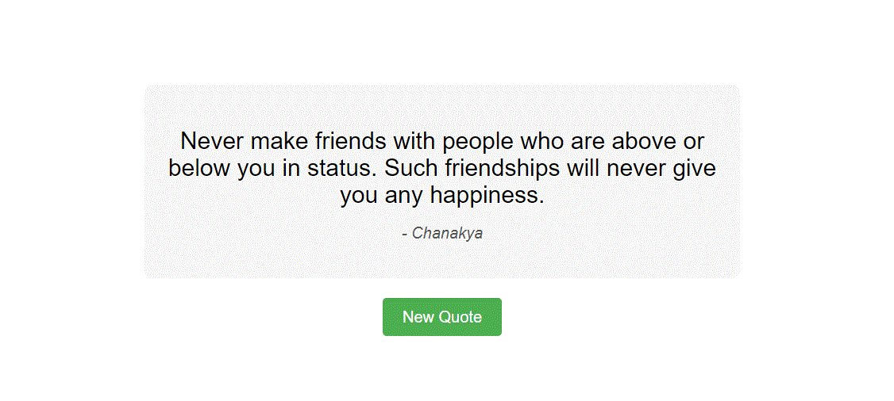

# Random Quote Generator

A simple web application that fetches and displays random quotes using the Quotable REST API. This project is designed to help you practice working with APIs in JavaScript.

## Demo



## Features

- Fetch and display random quotes from the Quotable REST API.
- Simple and clean user interface.

## Folder Structure

```
random-quote-generator/
|-- index.html
|-- style.css
|-- script.js
|-- demo.gif
|-- README.md
```

## Installation

1. Clone the repository to your local machine:
   ```bash
   git clone https://github.com/ViragRajput/random-quote-generator.git
   ```

2. Open the project folder:
   ```bash
   cd random-quote-generator
   ```

3. Open `index.html` in your preferred web browser.

## Usage

1. Click the "New Quote" button to fetch and display a random quote.
2. Enjoy the wisdom and inspiration from the displayed quote!
3. Feel free to customize the project or integrate it into your own website.

## Note
This Random Quote Generator is a practical JavaScript project designed to strengthen your skills in API fetching, asynchronous programming, and DOM manipulation. Engage with this project to gain valuable experience in building dynamic web applications. Feel free to explore and modify the code to deepen your understanding and set the groundwork for future web development endeavors. 

Happy coding!

## License

This project is licensed under the MIT License - see the [LICENSE](LICENSE) file for details.
